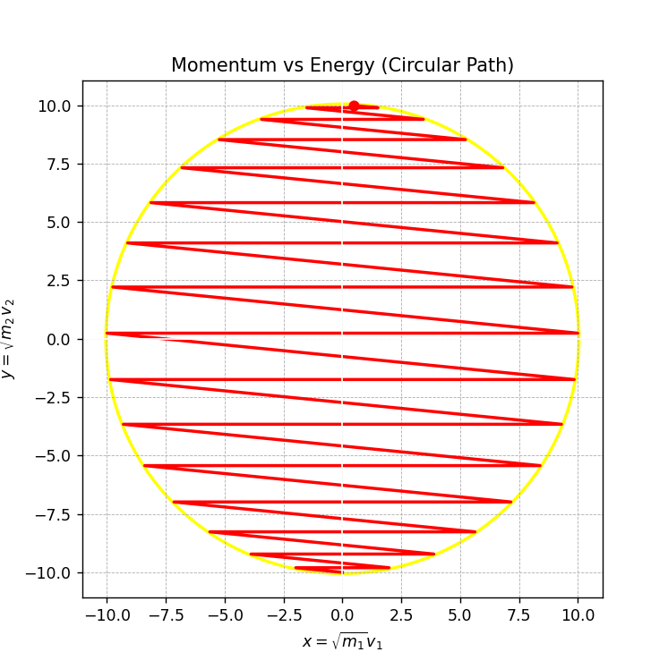

# **π Collisions Simulation: Energy-Momentum Circular Path**

## **Overview**
This project simulates **elastic collisions** between two masses, one of which collides with a **wall on the left**. It demonstrates a fascinating connection between **physics and mathematics**:  

- The **number of collisions** corresponds to the **digits of π** when the mass ratio is a power of 100.  
- The **momentum-energy relationship** traces a **circular path** in transformed coordinates.  
- This provides a **graphical proof** that **energy conservation in elastic collisions** leads to a circular equation.

---

## **Simulation Preview**


---

## **How It Works**
### **1. Simulation (Pygame)**
- Two masses move on a **frictionless surface**.  
- The **larger mass** moves toward the **smaller mass**, which is near a wall.  
- When they collide, their velocities update using **elastic collision equations**.  
- The simulation tracks **collision counts** and **momentum-energy states**.

### **2. Mathematical Transformation**
To visualize the circular path, we define:  
\[
x = \sqrt{m_1} v_1, \quad y = \sqrt{m_2} v_2
\]  
This ensures the system follows the equation of a **circle**:  
\[
x^2 + y^2 = C
\]

### **3. Graphical Representation**
The transformed momentum-energy states are plotted in real-time. The trajectory **forms a perfect circle**, confirming the physics.

---

## **Graph: Why Collisions Form a Circle**


The plot shows:
- **X-axis**: \( x = \sqrt{m_1} v_1 \) (transformed velocity of mass 1).  
- **Y-axis**: \( y = \sqrt{m_2} v_2 \) (transformed velocity of mass 2).  
- The system **moves along the circular path**, proving that conservation laws create a **circular motion** in energy-momentum space.

---

## **Why Does the Collision Form a Circle?**
### **1. Conservation of Energy**
\[
\frac{1}{2} m_1 v_1^2 + \frac{1}{2} m_2 v_2^2 = E
\]  
This equation represents **constant total energy**.

### **2. Conservation of Momentum**
\[
m_1 v_1 + m_2 v_2 = P
\]  
Momentum remains conserved during collisions.

### **3. Transforming the Variables**
Rewriting the momentum equation:  
\[
\sqrt{m_1} v_1 + \sqrt{m_2} v_2 = P
\]  
Now substituting:
\[
x = \sqrt{m_1} v_1, \quad y = \sqrt{m_2} v_2
\]  
Rewriting the energy equation:
\[
\frac{1}{2} (x^2 + y^2) = E
\]  
Multiplying by 2:
\[
x^2 + y^2 = 2E
\]  
This is **the equation of a circle**, confirming that the system follows a circular trajectory!

---

## **How to Run the Simulation**
1. Install dependencies:
   ```bash
   pip install pygame matplotlib numpy
